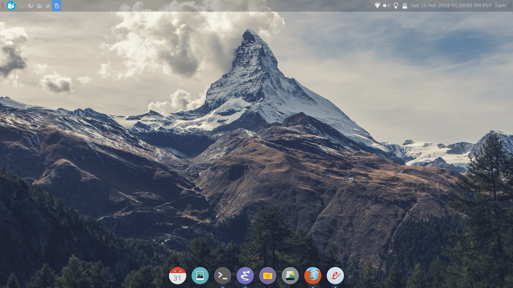

Dotfiles for vim, emacs, and others. Hack away like it's 1998!

Feel free to copy and paste, fork, clone, or anything you like.


# to add dotfiles (get started with vim for example):

```shell

# make a backup of your original config(s) just in case
mv ~/.vimrc ~/.vimrc.back
mv ~/.vim ~/.vim.back

# clone the repo
git clone https://www.github.com/lbeckman314/dotfiles.git

cd dotfiles

# gnu stow method (use if you have stow installed)
stow -t $HOME vim

# traditional method
# ln -s `pwd`/vim/.vimrc ~/.vimrc
# ln -s `pwd`/vim/.vim ~/.vim

```

# to remove dotfiles:

```shell

# restore backups
mv ~/.vimrc.back ~/.vimrc
mv ~/.vim.back ~/.vim

rm -rI dotfiles

```

# screenshots (in xfce)

wallpaper: [Mountainous View](https://unsplash.com/photos/VNseEaTt9w4) by [Sven Scheuermeier](https://unsplash.com/@sveninho)

neovim + tmux


emacs


rofi


blank

